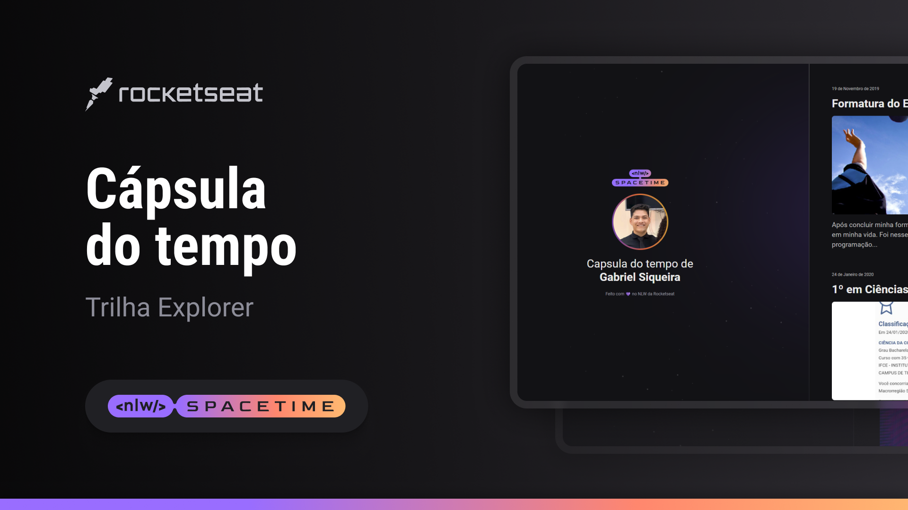

## 🖥️ Projeto 
Este é um projeto Web Responsivo de uma cápsula do tempo desenvolvido para exibir memórias em uma linha do tempo. A ideia foi proposta durante o evento NLW da Rocketseat.

## 🚀 Tecnologias
Esse projeto foi desenvolvido durante o NLW da Rocketseat com as seguintes tecnologias:

- HTML
- CSS
- Git e Gihub

## 🗂️ Layout
O Layout original que serviu de inspiração para esta aplicação está disponível no link abaixo. Para acessá-lo, é necessário ter uma conta no Figma.
[Projeto Original](https://www.figma.com/file/Rm5Bje7d6BQNS8inn70aRY/C%C3%A1psula-do-tempo-%E2%80%A2-Trilha-Explorer-(Community)-(Copy)?type=design&node-id=306-3&t=NIiKED7dW2nSpSCu-0) [Figma](https://www.figma.com)

